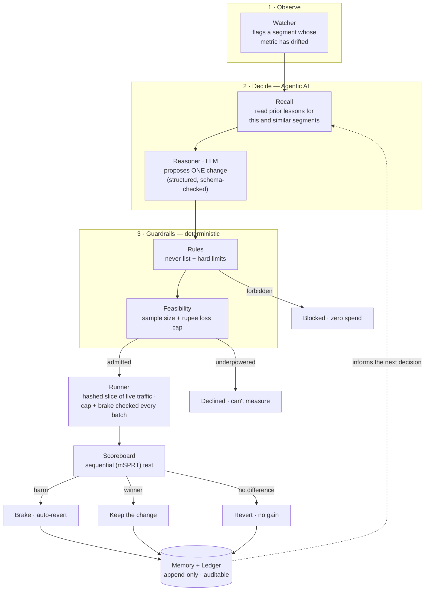

# PayProof

> **AI that runs safe experiments on your payments, judges the results, and keeps what wins — with memory and guardrails.**

PayProof is a safe-decision engine for payments. An AI agent proposes a change to a
merchant's checkout — which payment method to show first, how long to wait before
retrying a failed charge — PayProof rolls it out to a small, bounded slice of real
traffic, measures the true impact, and **keeps it if it helps or reverts it the
moment it hurts**. Every decision is capped in rupees, watched by an independent
brake, written to an append-only ledger, and remembered — so the next decision is
cheaper, safer, and smarter than the last.

*Razorpay AI Buildathon — **Open Track***

> 📄 For the full engineering write-up — architecture, every pipeline node, the guardrails,
> memory internals, the terminal, and the deepest bug we hit — see
> [**docs/TECHNICAL.md**](docs/TECHNICAL.md).

---

## The problem

When a merchant integrates payments, someone chooses the settings **once** — the
order of payment methods at checkout, the retry schedule for failed charges — and
then nobody revisits them. The business changes; the settings don't. A choice that
was right two years ago quietly leaks revenue today, and no one notices, because
testing a change on live traffic risks real orders. So the settings sit frozen.

There is a deeper version of the same problem. The industry is racing to put
**AI agents in charge of money actions** — growth agents, recovery agents, risk
agents. Every one of them needs the same thing before it can be trusted in
production: *a safe way to try its decision on real users and know whether it
actually worked, at a scale no human can hand-check.* That layer is the one nobody
is building. **PayProof is that layer.**

> Razorpay's own framing says it plainly: *"verification capacity, not generation
> speed, is the bottleneck."* PayProof is the verification capacity for autonomous
> payment decisions.

---

## The idea, in one line

**An AI proposes a decision → it's rolled out to a slice of users → the outcome is
studied → memory is consulted and updated → the guardrails keep it safe.**

Three pillars hold it up. Remove any one and it falls over:

| Pillar | What it is | Why it matters |
|---|---|---|
| **Agentic rollout** | The AI proposes one change; it runs on a hashed, bounded slice of live traffic — never the whole base. | Test on real users without betting the business. |
| **Memory** | Every outcome is stored and consulted *before* the next decision. Known dead-ends are skipped, new segments start from a prior. | The system gets cheaper and safer the more it's used — value compounds at scale. |
| **Guardrails** | A rupee spending cap, an independent brake, a rules engine, a sequential statistical test, and a full audit trail. | The downside is bounded — in money *and* in the risk of being wrong. |

---

## How it works

The core design rule: **the LLM proposes, deterministic code disposes.** The agent
is exactly one boxed step in a pipeline. Everything that touches money or declares a
result is deterministic, reproducible, and auditable — the LLM never sees a rupee and
never calls an outcome.



### The stages

| Stage | Role | Deterministic? |
|---|---|---|
| **Watcher** | Segments traffic and flags a segment whose completion or recovery rate has drifted. | Yes |
| **Recall** | Reads memory for this exact segment and similar ones before anything is decided. | Yes |
| **Reasoner** | *The one AI call.* Given the segment, its baseline, the policy, and recalled memory, it returns a single **structured proposal** (JSON, schema-validated): which lever, the hypothesis, the expected effect, the traffic share. | **No — this is the agent** |
| **Rules** | Checks the proposal against a human-authored policy: never-do list (e.g. never weaken authentication), traffic ceiling, one test at a time. Blocks with a reason. | Yes |
| **Feasibility** | Computes the sample size and duration to measure the claimed effect, and sets the **rupee loss cap** for the test. Declines anything underpowered — no traffic wasted on a test that can't conclude. | Yes |
| **Runner** | Hash-assigns live sessions into control vs. treatment, applies the treatment for that cohort, and tallies real outcomes. Checks the cap, the brake, and the split **on every batch**. | Yes |
| **Scoreboard** | A sequential test (mSPRT) with asymmetric thresholds: weak evidence stops a test, strong evidence promotes it. Decides keep / revert / no-difference. | Yes |
| **Memory + Ledger** | Writes the lesson (with a confidence) and the full decision trail. Every number on every screen re-derives from here. | Yes |

Because the LLM fires **once per candidate segment** — not once per payment — the
expensive, non-deterministic part stays off the hot path. The runner and scoreboard
process live traffic at scale with no model in the loop. *That is why it scales.*

---

## Safety & responsible AI

PayProof is built so that an autonomous agent can be trusted with production payment
settings. Safety isn't a feature bolted on — it's the architecture.

**The AI cannot act on its own.** The reasoner only *proposes*. It has no path to
change a setting, move money, or declare a result. Pull the model out entirely and
the deterministic pipeline still runs and still decides.

**Money guardrails — the downside is bounded in rupees.**
- Every test gets a hard **rupee loss cap** computed *before* it starts.
- Realized loss is checked **every batch** against that cap; the cap is never
  exceeded (validated `cap_broken = 0` across every configuration tested).
- An **independent brake** outranks the agent: on evidence of harm it halts and
  **auto-reverts** to the previous setting.
- Stopping for harm requires far *less* evidence than promoting a winner — the
  system is deliberately biased toward safety (borrowed from clinical-trial design,
  where a bad arm is stopped early).

**Truth guardrails — the risk of being *wrong* is bounded too.**
- A **sequential test** replaces naive "peek and ship" A/B reads, which declare
  phantom winners far too often. In validation, naive peeking ships a false winner
  ~**44%** of the time on a zero-effect change; PayProof's sequential boundary,
  ~**5%**.
- The decision engine is **firewalled from outcome labels** used in validation — an
  automated check fails the build if any decision module can even import them. So
  when PayProof says it found a real pattern, that means something.

**Guarded, reversible, auditable, human-governed.**
- Changes are **bounded** (a small traffic slice), **reversible** (one-command
  revert, applied automatically), and **auditable** (an append-only ledger where
  every figure traces to a row).
- The policy — what's allowed, the caps, the thresholds — is **authored by a human**
  in `policy.yaml`. The agent operates strictly inside it.
- PayProof runs against **Razorpay test-mode** with pre-authorized budgets; no change
  touches production revenue beyond its bounded, capped envelope.
- It is **defense-oriented and merchant-serving**: it improves a merchant's own
  checkout within limits they set. It never weakens authentication, never moves
  customer money, and never takes an irreversible action.

---

## Memory — the compounding advantage

A plain experimentation tool runs a test and forgets. It starts from zero every time.
PayProof starts from everything it has ever seen.

- **Consulted before every decision.** Before a test runs, PayProof reads its memory
  for that segment. If it already concluded the answer, it **skips the test and
  spends zero traffic** — it won't relearn what it knows.
- **Written after every conclusion.** Each result becomes a durable, confidence-tagged
  claim, tagged by segment and lever.
- **Compounds at scale.** A new segment starts from what similar segments taught, so
  it needs less evidence to reach a safe answer. In validation, an experienced agent
  reaches the real win in **1 experiment and ₹0 at risk**, versus **3 experiments and
  ~₹4,700 at risk** cold — it walks past the dead-ends it already mapped.

Memory of what **didn't** work is worth as much as the wins: it's the record that
keeps the agent from repeating an expensive mistake.

---

## Integrating into the Razorpay ecosystem

PayProof reads and writes only through Razorpay's own surfaces, which makes both of
its levers real, merchant-controlled features:

- **Payment-method ordering** — Razorpay Checkout lets merchants group methods into
  *blocks* and set the *sequence* they appear in (`config.display.blocks` /
  `sequence`), from the Dashboard or at runtime. PayProof drives this per cohort to
  test, e.g., cards-first vs. UPI-first for a specific customer segment.
- **Retry timing** — Razorpay's Intelligent Retry Engine lets merchants configure the
  retry cadence for failed charges. PayProof tests, e.g., waiting longer before the
  first retry to let an issuing bank recover.
- **Outcome measurement** — real payment events arrive via **webhooks**; PayProof
  tallies completion and recovery rates per cohort from them.
- **Read-only onboarding** — PayProof begins by *observing* a merchant's current
  settings and historical outcomes; it only proposes changes once it has a baseline.

The same engine generalizes to any reversible, measurable decision in the Razorpay
stack — gateway routing, failed-payment recovery channel (WhatsApp vs. SMS vs. email),
offer/EMI surfacing, or risk-threshold tuning. The decision domain is pluggable; the
**rollout → measure → guardrail → remember** loop is the product.

---

## Validation

Every claim PayProof makes is measured, not asserted, and re-derivable from the
ledger.

| Claim | Result |
|---|---|
| Naive A/B ships a false winner on a zero-effect change | ~**44%** of the time |
| PayProof's sequential test, same data, same peeking | ~**5%** |
| Spending cap breaches across all tested configurations | **0** |
| Hidden patterns recovered from noisy outcomes (scored vs. known truth) | **4 / 4** |
| Experiments + money at risk, experienced vs. cold | **1 / ₹0** vs. **3 / ~₹4,700** |

The pattern-recovery result is the sharpest: across many independent runs, the
verdicts PayProof discovered from noisy observations — win / harm / no-difference —
matched the true per-segment effects it was firewalled from seeing.

---

## The operator experience

PayProof is driven from a browser-based control surface — a **cockpit** with a live
node-graph of the pipeline, a real Razorpay-style checkout showing each test on real
users, a memory graph, a run registry with generated reports, and a validation view.

At its heart is a **terminal** an operator uses like a real tool:

```bash
test cards mobile returning 1k-3k     # define one experiment; watch the engine run it
test cards mobile returning 1k-3k     # run it again → skipped by memory, zero spend
compare 1 2                           # diff two runs: which lever moved, what changed
set max_traffic_share 0.25            # tune a policy limit at runtime
forget                                # reset memory to a cold start
patterns                              # discovered verdicts, scored against known truth
report / runs / ledger / memory       # the audit trail, on demand
```

An operator can stand at the terminal and say: *"watch — I propose a change, the
engine tests it safely, remembers it, and refuses to waste traffic re-testing it,"*
then change one policy lever and show the outcome shift.

---

## Architecture & stack

- **Reasoning** — a single structured-output **LLM** call (Gemini) per candidate
  segment, schema-validated, with a deterministic local fallback if the model is
  unreachable.
- **Engine** — Python: watcher, rules, feasibility, runner, scoreboard, recall,
  memory. No model in the hot path.
- **Store** — **SQLite** ledger: tests, decisions, learnings, and an archived run
  registry. Append-only, fully auditable.
- **API** — **FastAPI**, streaming the decision pipeline over Server-Sent Events.
- **Cockpit** — **Next.js** + React Flow node graphs, framer-motion, a real
  Razorpay-style checkout with authentic payment marks.

```
backend/
  watcher.py      feasibility.py   scoreboard.py    report.py
  reasoner.py     runner.py        recall.py        patterns.py
  rules.py        pipeline.py      ledger.py        evidence.py
  config.py       main.py (API)    models.py
policy.yaml                     # the human-authored policy the agent runs inside
web/                            # the Next.js cockpit + terminal
```

## Running it

```bash
# 1 · engine + API
python -m venv .venv
.venv/Scripts/pip install -r backend/requirements.txt
python -m pytest -q                                   # the test suite reads like a spec
python -m uvicorn backend.main:app --port 8100        # the API

# 2 · cockpit
cd web
npm install
npm run dev                                           # open http://localhost:3000
```

---

## Built for the Razorpay AI Buildathon — Open Track

The four defined tracks each ask you to build an AI that takes a money action —
growth, risk, recovery, finance. **PayProof is the layer none of them is: the safe
rollout, measurement, and memory harness that lets any of those decisions be turned
on in production and *proven* to work at scale.** It's orthogonal to all four by
construction, and it sits exactly where Razorpay says the bottleneck is —
verification, not generation.

How it maps to the judging bar:

- **Problem taste** — the unglamorous, essential layer that makes autonomous payment
  decisions shippable. Everyone assumes it; nobody builds it.
- **Build quality** — an end-to-end engine with a passing test suite, a reproducible
  deterministic core, and an audit trail where every number traces to a row.
- **AI judgment** — the LLM is used for exactly the one thing it's good at (proposing
  what to try across messy segments) and deliberately kept out of every decision that
  touches money or truth.
- **Reliability & failure recovery** — bounded, reversible, capped, brake-protected,
  and firewalled from the labels it's scored against.

---

*PayProof · proving payment decisions before they ship.*
