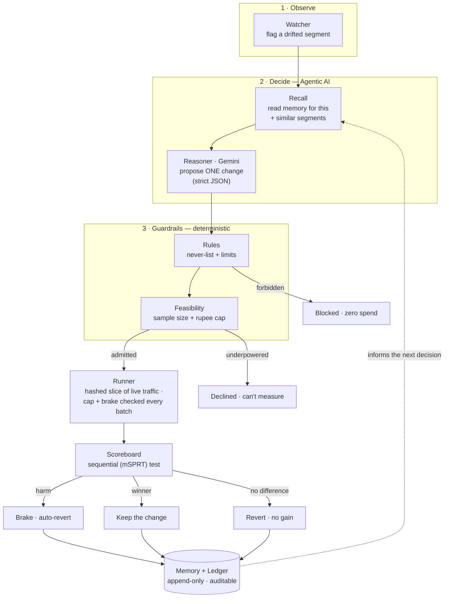

# PayProof — Technical Deep-Dive

> **PayProof is an evaluator for AI payment decisions.** An agent proposes a change to a
> merchant's checkout, PayProof runs it as a bounded experiment on a slice of real users,
> judges the outcome against real results, keeps what wins and reverts what hurts — with
> **memory** so it gets smarter, and **guardrails** so it can never cost more than a
> pre-set rupee cap.

This document explains what's built, how, and why — end to end.

---

## Table of contents

1. [The thesis: act vs. evaluate](#1-the-thesis-act-vs-evaluate)
2. [Tech stack](#2-tech-stack)
3. [System architecture](#3-system-architecture)
4. [The pipeline — every node explained](#4-the-pipeline--every-node-explained)
5. [How one experiment flows, end to end](#5-how-one-experiment-flows-end-to-end)
6. [The reasoning layer — how the AI generates a proposal](#6-the-reasoning-layer--how-the-ai-generates-a-proposal)
7. [Guardrails — money, truth, governance](#7-guardrails--money-truth-governance)
8. [Memory — how it works and how it's referenced](#8-memory--how-it-works-and-how-its-referenced)
9. [The validation world and its hidden truth](#9-the-validation-world-and-its-hidden-truth)
10. [Scenarios — what the run is pre-fed with](#10-scenarios--what-the-run-is-pre-fed-with)
11. [The terminal — why, and every command](#11-the-terminal--why-and-every-command)
12. [What's visible on the website](#12-whats-visible-on-the-website)
13. [The Proof view — what every number means](#13-the-proof-view--what-every-number-means)
14. [Data model — the ledger](#14-data-model--the-ledger)
15. [Integrating into Razorpay](#15-integrating-into-razorpay)
16. [How it differs from the four tracks](#16-how-it-differs-from-the-four-tracks)
17. [What broke, and how it was fixed](#17-what-broke-and-how-it-was-fixed)
18. [Why it's technically robust](#18-why-its-technically-robust)
19. [Running it](#19-running-it)

---

## 1. The thesis: act vs. evaluate

The buildathon's four defined tracks all ask you to build an AI that **takes an action** —
grow revenue, recover a payment, catch fraud, close the books. They share one blind spot:
once an AI makes a decision and pushes it to real users, *nobody checks whether it actually
worked — and stops it if it didn't.* Razorpay's own brief names the gap: *"verification
capacity, not generation speed, is the bottleneck."*

PayProof is that verification layer. It doesn't compete with the four tracks — it's the
thing that makes any of them safe to turn on in production and *provable* at scale.

---

## 2. Tech stack

| Layer | Choice | Why |
|---|---|---|
| Reasoning | **Google Gemini** (structured output, called via Python stdlib `urllib`) | One schema-constrained call per candidate; no heavy SDK |
| Engine | **Python** — watcher, rules, feasibility, runner, scoreboard, recall, memory | Deterministic, testable, no model in the hot path |
| Statistics | **mSPRT** sequential test (hand-rolled) | Correct false-positive control under repeated peeking |
| Store | **SQLite** — append-only ledger + run registry | Zero-ops, fully auditable, every number re-derivable |
| API | **FastAPI** + **Server-Sent Events** | Streams the decision pipeline card-by-card |
| Cockpit | **Next.js 16** (App Router, Turbopack, TypeScript) | The operator UI |
| Graphs | **@xyflow/react** (React Flow) | The pipeline + memory node graphs |
| Motion / styling | **framer-motion**, **Tailwind**, **ShadCN**, **lucide** | The airy light theme |
| Tests | **pytest** — 22 tests | Safety invariants as executable specs |

Deliberately small: no message queue, no vector DB, no ORM. SQLite and the standard library
do the work; the cleverness is in the design, not the dependency list.

---

## 3. System architecture



**The core invariant:** the LLM proposes, deterministic code disposes. The model is exactly
one boxed step. Everything that touches money or declares a result is deterministic,
reproducible, and logged. Pull Gemini out entirely and the pipeline still runs and still
decides — using its local fallback proposer.

**Data flow:** the FastAPI backend runs the pipeline, which appends one JSON line per stage
to an event log **and** writes structured rows to the SQLite ledger. `/stream` replays the
event log over SSE; the cockpit is a pure function of that stream. Every figure on screen
re-derives from a ledger row — nothing is computed in the browser.

---

## 4. The pipeline — every node explained

The graph on the **Pipeline** tab is not decoration; each node is a real module. Seven
main stages (top row) and five sub-processes (bottom row).

| Node | Module | What it represents | Function (inputs → output) |
|---|---|---|---|
| **Watcher** | `watcher.py` | The eyes | Segments traffic (device × customer type × order band), computes each segment's baseline, and **flags** one whose completion/recovery rate has drifted. → a flagged segment |
| **Reasoner** | `reasoner.py` | The one AI call | Given the segment + baseline + policy + recalled memory, calls **Gemini** for a single structured **Proposal**. Falls back to a local proposal if the model is unreachable. → a `Proposal` |
| **Rules** | `rules.py` | The bouncer | Checks the proposal against the human-authored `policy.yaml`: never-do list, traffic ceiling, order-value window, one test at a time. → allow / **block(reason)** |
| **Feasibility** | `feasibility.py` | The statistician-accountant | Computes the sample size and days needed to detect the claimed effect (`16·p(1-p)/effect²`) and sets the **rupee loss cap**. Declines anything underpowered. → admit(cap) / **decline** |
| **Runner** | `runner.py` | The lab | Hash-assigns live sessions into control/treatment, draws outcomes, tallies day by day, and checks the cap + brake + split **every batch of 40**. → a terminal `TestStatus` |
| **Scoreboard** | `scoreboard.py` | The judge | The **mSPRT sequential test** with asymmetric thresholds. Decides winner / harmful / no-difference. → the verdict |
| **Memory** | `ledger.py` + `recall.py` | The record & the brain | Writes the concluded lesson (with a confidence) and is read *before* the next decision. → a durable claim |

**Sub-nodes** (bottom row) light up when their parent stage is active:

- **Gemini** — the live model call, under Reasoner.
- **Ledger recall** — the memory lookup that feeds Reasoner (and gates the run).
- **Policy** — `policy.yaml`, read by Feasibility for the caps.
- **Simulator** — the world the Runner draws outcomes from (in production: live traffic).
- **Brake** — the independent monitor under Runner that can halt and revert.

The camera follows the active stage; edges carry animated "data" dots, brighter on the live
path — so the graph literally shows the decision moving through the system.

---

## 5. How one experiment flows, end to end

Take the demo's headline beat — testing cards-first for desktop-new buyers, which is
secretly harmful:

1. **Watcher** flags `desktop · new · ₹1k–3k`.
2. **Recall** checks memory: no prior signal → test fresh. (Emits a `RECALLED` card.)
3. **Reasoner** proposes: *"Show cards first for desktop new buyers, expect ~5pp, watch
   completion, 10% traffic."* (Emits `PROPOSED`.)
4. **Rules**: allowed (doesn't touch anything on the never-list, within the ceiling).
5. **Feasibility**: measurable at this volume; sets a cap, e.g. **₹37,400**. (Emits `CAP_SET`.)
6. **Runner** starts. Sessions hash into control (UPI-first) vs. treatment (cards-first).
   Each batch of 40, it recomputes rates, the confidence-bounded realized loss, and the harm
   CI. (Emits one `RUNNING` card per simulated day; the checkout on screen shows both arms'
   live completion.)
7. Treatment completion falls. The **harm CI** excludes zero → the **brake fires**:
   `BRAKE_PULLED`, realized loss frozen **under** the cap, then `REVERTED` (settings rolled
   back to UPI-first).
8. **Memory** writes: *"For new desktop shoppers, showing cards before UPI pushed checkout
   completion down by about 5 points — so we reverted it and won't try it again."* (`LEARNED`.)

Every card in that sequence is a real event appended to the log; the money-at-risk number,
the completion rates, and the cap are all read back from the ledger.

---

## 6. The reasoning layer — how the AI generates a proposal

The **only** place an LLM is used. `reasoner.py`:

- Builds a prompt from the flagged segment, its observed baseline, the policy's allowed test
  kinds, and **recalled memory** ("what we tried on this and similar segments, and how it
  ended").
- Calls Gemini (`gemini-3.6-flash`) with a **`responseSchema`** that forces the output into a
  single `Proposal` object: `what_changed`, `test_kind` (only `payment_method_order` or
  `retry_timing`), `slice`, `traffic_share`, `metric_to_watch`, `why`, `touches[]`,
  `effect_to_detect_pp`. Anything off-schema is rejected.
- If the model is unreachable or returns junk, it **falls back** to a deterministic local
  proposal, and the card is visibly tagged as degraded — the honesty is shown, not hidden.

Crucially, the proposal is a *hypothesis*, not an action. The model never sees a rupee,
never runs the test, never calls the outcome. The proposal is then scored later against the
deterministic result — so you can even measure how good the proposer is.

Because the model fires **once per candidate segment** (not once per payment), the expensive,
non-deterministic part is off the hot path. The Runner and Scoreboard chew through traffic
with no model in the loop — which is exactly why the system scales.

---

## 7. Guardrails — money, truth, governance

Guardrails aren't a feature bolted on; they're the reason an autonomous agent can be trusted
with production settings. There are **three kinds**.

### Money guardrails — bound the downside in rupees
- **Loss cap per test** — `feasibility.py` sets a hard rupee cap *before* the test starts.
- **Per-batch enforcement** — the Runner checks realized loss against the cap every 40
  sessions, leaving a full margin (a fraction of the cap) so a single batch can never jump it.
  Validated: **`cap_broken = 0` across 50 seeds.**
- **Independent brake** — a separate check (`is_harmful` on the harm-level confidence
  interval) outranks the agent and halts on credible harm.
- **Auto-revert** — a stopped test rolls the setting back to the control automatically.
- **Asymmetric evidence** — stopping for harm needs far *less* evidence than promoting a
  winner (borrowed from clinical-trial design: stop a bad arm early).

### Truth guardrails — bound the risk of being *wrong*
- **Sequential test (mSPRT)** — replaces naive "peek and ship," which declares phantom
  winners far too often. Measured: a zero-effect change is shipped by naive peeking **~44%**
  of the time vs. **~5%** by PayProof's sequential boundary.
- **Split health** — if the A/B assignment drifts unbalanced, the result would be
  meaningless, so the test is stopped.
- **Ground-truth firewall** — the agent's decision modules (`reasoner`, `watcher`, `rules`,
  `feasibility`, `scoreboard`) are provably forbidden from importing the world's hidden
  outcomes. `test_truth_isolation.py` fails the build if any of them does, and checks in a
  clean subprocess that importing the agent side never loads the truth module. So *"the AI
  found the pattern"* means something.

### Governance guardrails — human-authored, bounded, auditable
- **Policy is human-written** — `policy.yaml` holds the never-list, caps, and thresholds; the
  agent operates strictly inside it.
- **Never-list** — e.g. *never weaken authentication.* A proposal that would `skip_authentication`
  is blocked before a rupee moves.
- **Bounded & reversible** — a small traffic slice, one command to revert (applied
  automatically).
- **Auditable** — an append-only ledger where every figure traces to a row.
- **Test-mode & defense-only** — runs against Razorpay test-mode with pre-authorized budgets;
  it only improves a merchant's own checkout within limits they set, never moves customer
  money, never takes an irreversible action.

---

## 8. Memory — how it works and how it's referenced

Memory is the difference between a testing tool and a system that gets smarter.

**Written** — when a test concludes, `runner.py` writes a row to the `learnings` table
(claim + a confidence derived from the effect size relative to the target) and the ledger
records the full decision.

**Referenced before every decision** — `conduct()` in `pipeline.py` calls
`recall.recall_for(segment, lever)` *first*. It looks up concluded tests for that exact
segment + lever and returns a verdict. This emits a `RECALLED` card ("memory: this HURT here
before" / "no prior signal — testing fresh").

**It changes the decision** — if memory already holds a concluded result for that exact
segment + lever, the agent emits `SKIPPED_BY_MEMORY` and **spends no traffic** — it won't
relearn what it knows. This is the visible "memory drove the decision" moment; the cockpit
flips to the Memory view to show why.

**It compounds** — reading the ledger, an experienced agent reaches the real win in **1
experiment and ₹0 at risk**, versus **3 experiments and ~₹4,700** cold, because it walks past
the dead-ends it already mapped. Memory of what *didn't* work is worth as much as the wins —
it's the record that prevents repeating an expensive mistake.

The live reasoner also receives recalled history in its prompt, so the *proposal* itself is
memory-aware, not just the gate.

---

## 9. The validation world and its hidden truth

To prove the method works, the current build runs the Runner against a **simulated world**
(`sim/world.py`) with a **hidden ground truth** (`sim/truth.py`) — the real per-segment
effect of each change. This is standard offline validation: because we know the right answers,
we can score whether the agent discovered them. In production, the same Runner drives
Razorpay's live APIs and the sequential test *is* the protection (there is no answer key).

The hidden truth is deliberately isolated: only `sim/world.py` may import it, and the agent's
decision code can't (enforced by `test_truth_isolation.py`). Effects are inflated vs. reality
(6–7 points here vs. 1–3 in the wild) so the loop is visible in a short run — stated plainly.

Example truth (`_EFFECTS_PP`): mobile·returning `+7` (a real win), desktop·new `−5` (harmful
in-window), mobile·new `0` (the honesty case), plus a separate retry-timing truth where
mobile·new gains `+6` on recovery.

---

## 10. Scenarios — what the run is pre-fed with

`simulate` replays a curated set of proposals (`cli.py::_proposals`) chosen so that **every
end-state fires** — a complete tour of the decision surface. In order:

| # | Proposal | Outcome | What it demonstrates |
|---|---|---|---|
| 1 | cards-first, mobile·returning, **25%** traffic | **BLOCKED** | traffic ceiling is 10% |
| 2 | cards-first, mobile·returning, 10% | **KEPT** (+~6pp) | a real win, promoted |
| 3 | cards-first, desktop·new | **BRAKE → REVERTED** | harm caught, loss capped |
| 4 | cards-first, mobile·new | **NO DIFFERENCE** | honesty — a true null, not shipped |
| 5 | retry-timing (wait 6h), mobile·new | **KEPT** (+~6pp recovery) | a *second lever/family* — it generalizes |
| 6 | re-check desktop·new | **SKIPPED_BY_MEMORY** | memory prevents re-testing |
| 7 | re-check mobile·returning | **SKIPPED_BY_MEMORY** | compounding, on screen |
| 8 | retry that would `skip_authentication` | **BLOCKED** | the guardrail refuses |
| 9 | cards-first, order > ₹5k | **BLOCKED** | outside the tested order window |

The operator's `test` command builds *any* proposal from the same machinery — the curated
list is just one script; the engine is general. All outcomes are **deterministic per seed**
(see §17).

---

## 11. The terminal — why, and every command

**Why a terminal.** PayProof is a technical, operator-driven product, not a slideshow. The
terminal is the control surface: an operator composes an experiment, tunes a policy lever,
resets memory, and inspects the audit trail — live, reproducibly. It reads as a real tool,
which is exactly the point for a technical audience.

| Command | What it does | Pre-fed with |
|---|---|---|
| `simulate [--live]` | Runs the full curated sweep (§10); `--live` calls Gemini per segment | the 9 curated proposals; `policy.yaml`; the world model |
| `test <lever> <device> <customer> <band> [--traffic N] [--effect N]` | Runs **one operator-defined experiment** through the real pipeline | your args → a `Proposal`; memory **persists** across calls |
| `forget` | Wipes the agent's memory (tests/decisions/learnings) so the cold start can be shown again | — |
| `set <key> <value>` / `set reset` | Tunes a policy limit at runtime (an in-memory override; `policy.yaml` is never mutated) | the tunable keys (traffic share, loss cap, `harm_alpha`, `alpha`, …) |
| `config` | Prints current limits + seed | the live (possibly overridden) policy |
| `seed <N>` | Sets the simulation seed for reproducible runs | — |
| `runs` | Lists the archived run registry | every run's summary snapshot |
| `report [id]` | Prints a generated report for a run (verdict, levers, learnings, refusals) | the ledger for that run |
| `compare <A> <B>` | Diffs two runs — which lever moved, and how the outcomes changed | two registry rows |
| `patterns` | Runs the agent across many segments and scores each verdict vs. the hidden truth | the validation world |
| `dataset` | The observable world — segments, daily traffic, order sizes | `sim/world.py` shares |
| `policy` | The boundaries the agent runs inside | `policy.yaml` |
| `ledger` | Every test and how it ended | the `tests` table |
| `memory` | What the agent has learned, in plain English | the `learnings` synthesis |
| `help` / `clear` | usage / clear screen | — |

Two touches for live use: the terminal **enlarges while you type** (readable on a projector),
and history is navigable with the arrow keys.

The killer sequence: `forget` → `test cards mobile returning 1k-3k` (runs, wins, remembers) →
same command again → **SKIPPED_BY_MEMORY, ₹0 spent.** Memory driving a decision, on the
operator's own inputs.

---

## 12. What's visible on the website

A single-screen **cockpit**: a header (brand, the one-line what-it-is, sim/real clocks, a
Gemini reasoning toggle, **Run experiment**, a READY/RUNNING status), a **canvas** with a
five-view switcher, and an **inspector rail** (latest signal · money-at-risk · the terminal).

The five canvas views:

- **Pipeline** — the live node graph (§4). Camera follows the active stage; edges flow.
- **Checkout** — a real Razorpay-style checkout, shown twice (control UPI-first vs. treatment
  cards-first) with live per-arm completion, authentic UPI/GPay/PhonePe/card marks, and the
  green "Payment Successful" / red "Reverted" overlays. Swaps to a **retry-schedule** visual
  when the active test is retry-timing.
- **Memory** — the hub-and-claims graph; each card a plain-English lesson, coloured by verdict
  (green kept / red reverted / grey no-change).
- **Runs** — the archived run history + the selected run's generated report.
- **Proof** — the validation (see §13).

The inspector rail shows the **latest signal** (with a red "Refused" spotlight on a blocked
proposal and the forbidden lever as a chip), and **money-at-risk** (which flips to a pulsing
"BRAKE FIRED" state when the brake reverts a harmful test, showing the loss halted under the
cap).

---

## 13. The Proof view — what every number means

The Proof tab answers *"does it actually work?"* with measured, re-derivable numbers.

- **Patterns extracted vs. the hidden truth** (`patterns.py`, `/patterns`). For each segment,
  the agent is run across many seeds; the **verdict it discovered** (win / harm / no-change)
  and its **stability** (e.g. 15/15 seeds agree) are shown next to the **true effect** — which
  is revealed *only to score*. Result: **4/4 recovered.** The discovered magnitudes run
  slightly hot (e.g. +7.8 vs. +7.0) — that's **winner's-curse**, the upward bias of an effect
  measured *conditional on stopping as a winner*; the sign/verdict is what's recovered, and
  that matches every time.
- **"Would a naive A/B be safe?"** (`evidence.py::false_positive_inflation`). Over 200 trials
  where the change truly does nothing, naive peek-and-ship declares a false winner **~44%** of
  the time; the sequential test **~5%**. Same data, same peeking — the boundary is the fix.
- **"Does memory compound?"** (`cold_vs_experienced`). Cold: 3 experiments, ~₹4,700 at risk.
  With memory: 1 experiment, ₹0. It skips the dead-ends it already learned.
- **"Did the cap ever break?"** (`cap_violations`). **0** breaches across 80 tests / 20 seeds.

Every one is computed by running the actual engine — not typed into a slide.

---

## 14. Data model — the ledger

SQLite (`ledger.py`), append-only, the single source of truth:

- **`tests`** — one row per test: id, run_id, headline, `test_kind`, `slice_json`, status,
  traffic_share, feasibility, `max_loss_inr`, `realized_loss_inr`, `cap_broken`, rules verdict,
  timestamps.
- **`decisions`** — the scoreboard's output per test: decision, uplift, CI bounds, reason.
- **`learnings`** — the memory: `test_id`, `claim`, `slice_json`, `confidence_from_stats`.
- **`brake_events`**, **`policy_snapshots`** — safety and policy audit.
- **`runs`** — the run registry: one archived snapshot per invocation (seed, policy levers,
  outcome counts, loss, cap breaches, horizon), so history persists and runs compare even
  after a same-seed re-run overwrites the per-test rows.

`clear_run()` wipes a run's per-test rows at the start of each run (so the tables hold the
latest run), while the registry keeps the historical summary. Every dashboard number
re-derives from these tables.

---

## 15. Integrating into Razorpay

Both levers are real, merchant-controlled Razorpay features, so integration is reading and
writing through Razorpay's own surfaces:

- **Payment-method ordering** — Razorpay Checkout lets merchants group methods into *blocks*
  and set the *sequence* (`config.display.blocks` / `sequence`), from the Dashboard or at
  runtime. PayProof drives this per cohort.
- **Retry timing** — Razorpay's Intelligent Retry Engine lets merchants configure retry
  cadence for failed charges. PayProof tests, e.g., waiting longer before the first retry.
- **Outcome measurement** — real payment events arrive via **webhooks**; PayProof tallies
  completion and recovery per cohort from them (replacing the simulator's `world.draw`).
- **Onboarding** — read-only first: observe current settings and historical outcomes, build a
  baseline, only then propose.

To productionize: swap `sim/world.py` for a live adapter (config API for the treatment,
webhooks for outcomes), point the ledger at a managed store, and run in test-mode with
pre-authorized budgets. The pipeline, guardrails, memory, and scoreboard are unchanged — the
decision domain is pluggable; the **rollout → measure → guardrail → remember** loop is the
product. The same engine generalizes to gateway routing, failed-payment recovery channel,
offer/EMI surfacing, or risk-threshold tuning.

---

## 16. How it differs from the four tracks

| | The four tracks | PayProof (Open Track) |
|---|---|---|
| Verb | **Act** — grow, recover, detect, reconcile | **Evaluate** — is the action right, and safe? |
| Question answered | "What should the AI do?" | "Did the AI's decision actually work, and can we trust it at scale?" |
| Relationship | each builds one agent | the layer that lets *any* agent ship safely |
| Razorpay's stated gap | generation | **verification — the bottleneck** |

They build the players; PayProof is the referee. It's orthogonal by construction, and it sits
exactly where Razorpay says the bottleneck is.

---

## 17. What broke, and how it was fixed

**The bug: a source of randomness leaked through a hash into a safety invariant.**

While wiring the memory loop, each test was given a random id — `test_id = uuid.uuid4()`. That
felt harmless. But the A/B **group assignment** is deterministic *given the id*:
`group_of(session_id, test_id) = sha256(session_id + test_id) < 0.5 ? treatment : control`.
Feeding a *random* `test_id` into that hash meant **every run assigned sessions differently**,
which had two consequences that took a while to connect:

1. **Non-reproducibility.** The same seed produced different outcomes each run. On one run the
   harmful desktop-new test braked; on the next it drifted to "no difference." A demo where the
   brake sometimes doesn't fire is unusable.
2. **A silent safety regression.** More seriously, on some assignments the confidence-bounded
   realized loss could jump within a single batch and land **over the cap** — `cap_broken = 1`.
   The headline safety claim ("the cap is never broken") was quietly false; random ids had been
   *masking* it by never landing on the bad assignment during earlier manual runs.

**The fix, in two moves — and this is the nuanced part.**

First, make the id **deterministic**: `test_id = sha256(run_id | what_changed | slice | kind |
traffic_share)[:8]`. Now the hash assignment is stable, every run is byte-for-byte
reproducible, and — a free win — same-seed re-runs *replace* their rows instead of
accumulating.

But determinism did something more useful than fix reproducibility: **it turned an
intermittent bug into a permanent one, which is the only kind you can actually fix.** With
random ids, `cap_broken` was a coin flip you'd never catch in CI. With deterministic ids, the
cap-safety test failed *every time on seed 18* — a real, reproducible violation that randomness
had been hiding. Determinism didn't cause the cap bug; it **exposed** a latent one.

So the second move was the real fix: the brake's stopping rule was widened from "stop when one
more order would exceed the cap" to **"stop when realized loss exceeds `cap − max(one order,
12% of cap)`"** — a full margin that accounts for the confidence-bounded loss jumping within a
batch. Then I brute-forced it: **`cap_broken = 0` across all 50 seeds**, and the honesty test
(a zero-effect segment) was rewritten from "never a false winner across 12 seeds" (impossible
at α = 0.05 — it contradicts our own 5% claim) to bounding the false-winner *rate* across 40
seeds.

The lesson, stated as a principle: **a random seed used for reproducibility is fine; a random
value that flows into a decision or a safety check is a bug generator.** Determinism isn't just
a nicety here — it's the tool that made a probabilistic safety property *testable*, and
therefore *true*.

---

## 18. Why it's technically robust

- **Deterministic core.** Given a seed, every run is byte-for-byte reproducible. The one
  non-deterministic component (the LLM) is boxed off the decision path with a deterministic
  fallback.
- **Safety as executable specs.** 22 pytest tests, including the ground-truth firewall and the
  cap-never-broken sweep — the safety claims are checked, not asserted.
- **Single source of truth.** An append-only ledger; every number on every screen re-derives
  from a row. Nothing is computed in the browser or typed into a slide.
- **Scales by construction.** No model in the measurement loop, so the Runner/Scoreboard
  handle real traffic volume; the LLM fires once per candidate.
- **Bounded, reversible, auditable, human-governed.** Capped in rupees, brake-protected,
  one-command revert, policy authored by a human, firewalled from the labels it's scored
  against.

---

## 19. Running it

```bash
# engine + API
python -m venv .venv
.venv/Scripts/pip install -r backend/requirements.txt
python -m pytest -q                               # 22 tests, the safety specs
python -m uvicorn backend.main:app --port 8100    # the API (SSE pipeline)

# cockpit
cd web && npm install && npm run dev              # http://localhost:3000
```

Project layout:

```
backend/   watcher · reasoner · rules · feasibility · runner · scoreboard
           recall · memory(ledger) · pipeline · patterns · evidence · report · main(API)
           sim/   world.py · truth.py           # validation world (isolated)
policy.yaml                                      # the human-authored policy
tests/     rules · feasibility · runner · evidence · truth_isolation
web/       the Next.js cockpit + terminal
```

---

*PayProof · proving payment decisions before they ship.*
